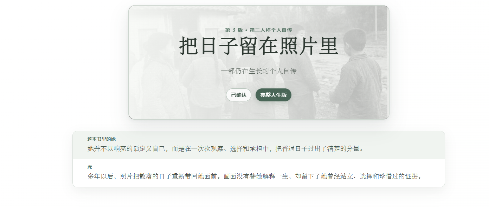
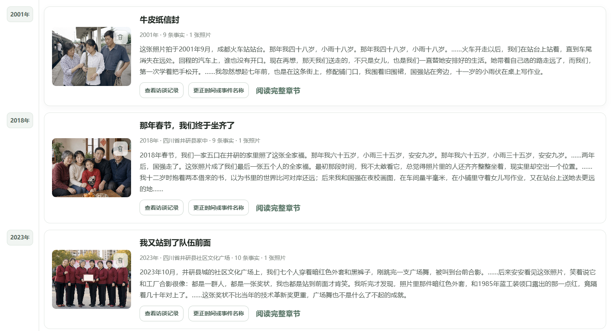
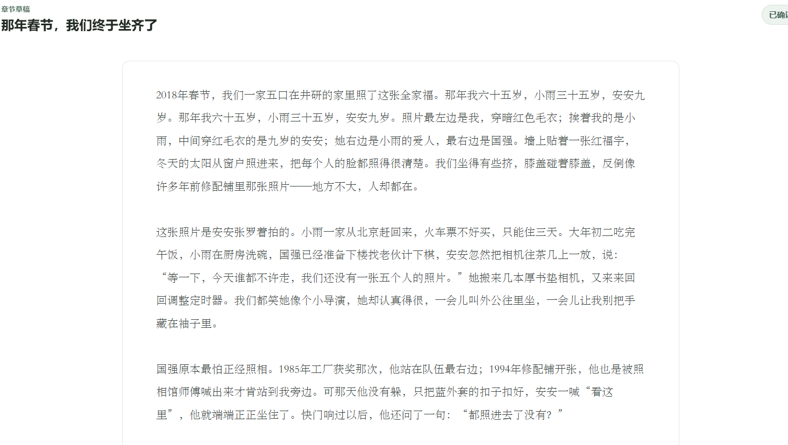
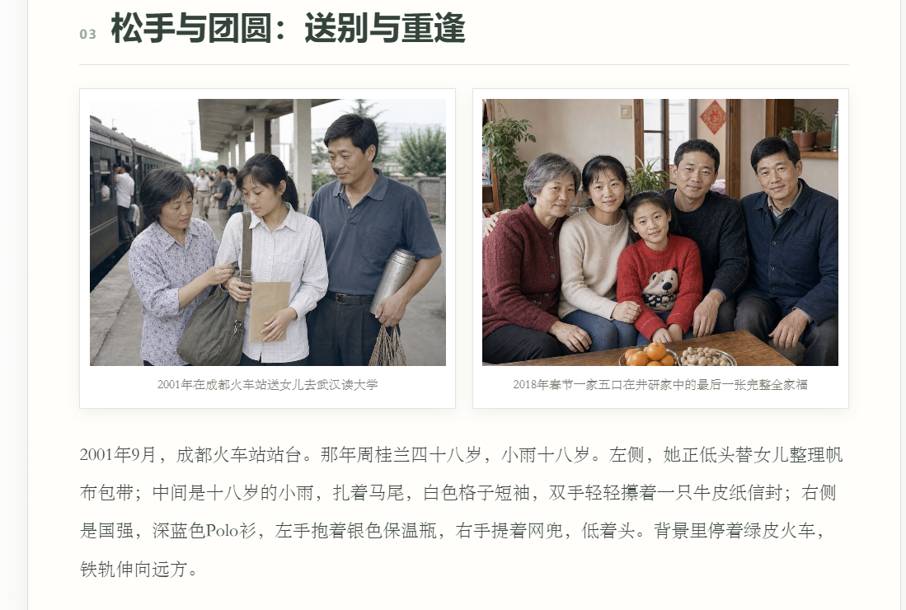

# 岁影 · Memoir Album

<div align="center">
  <p><strong>让每一张照片会讲故事，让每一个普通人都能拥有自己的自传。</strong></p>
  <p>
    <a href="https://github.com/nghjjnjnf/memoir-album/actions/workflows/ci.yml"></a>
    
    
    
  </p>
</div>

<p align="center">
  
</p>

岁影是一个照片驱动的多模态自传 Agent Demo。用户只需要上传一张照片，再用语音或文字讲述记忆；系统会理解画面、自然追问、整理人物与事件，并将零散的照片故事持续编排成具有文学性、人物价值和前后呼应的个人自传。

## 为什么需要它

相册保存了画面，却很少保存照片背后的人物关系、事件经过和当时的感受。随着时间推移，这些上下文会逐渐模糊；逐张手动补写既麻烦，也很难形成一部连贯的作品。

岁影把照片变成进入记忆的入口：先让用户在聊天中说出故事，再由 Agent 将记忆整理为可以阅读、修改、分享，并随着新照片不断生长的个人自传。

## 从一张照片，到一本自传

### 01 · 人生时间线：照片乱序上传，人生仍按真实时间展开

<p align="center">
  
</p>

每张照片对应一个人生事件。后上传的早年照片可以自动排到时间线前方；新访谈提到的旧人物和旧事件，也会回填到相关章节，而不是被困在当前对话中。

<table>
  <tr>
    <td width="50%" valign="top">
      
      <br><strong>02 · 照片成为文学章节</strong><br>
      <sub>事实、人物、场景和情绪被组织成可阅读、可修改、可确认的独立章节。</sub>
    </td>
    <td width="50%" valign="top">
      
      <br><strong>03 · 章节汇入完整人生叙事</strong><br>
      <sub>整书 Agent 重新理解人物关系、人生选择与叙事暗线，让不同照片自然衔接并前后呼应。</sub>
    </td>
  </tr>
</table>

## 核心能力

| 能力 | 实现方式 | 用户价值 |
|---|---|---|
| 多模态照片理解 | Vision Agent 提取人物、场景、物件、OCR与时间地点候选 | 不从空白开始回忆 |
| 陪伴式传记访谈 | 情绪承接、未解线索追踪、单问题追问 | 像聊天，而不是被审问或填表 |
| Timeline Memory | 事件级记忆、人物别称统一、跨访谈回填与时间重排 | 新故事可以补充过去，而不会覆盖过去 |
| 文学章节生成 | 事实约束、叙事价值提炼、文学质量门禁 | 照片不只是被描述，而是获得人生意义 |
| Living Autobiography | 整书导演、跨章改写、事实链接与连续性审校 | 一张照片能成文，新照片加入后整本书继续生长 |
| 可控版本与分享 | 候选稿仲裁、不可变版本、确认后发布 | 用户可以修改、拒绝，也不会污染真实记忆 |

```text
上传照片 → 后台识图 → 语音/文字访谈 → 人物与事件记忆
    → 文学章节 → 时间线编排 → 整书导演 → 持续生长的个人自传
```

### 修改不会偷偷覆盖原稿

新稿首先作为候选版本保存；只有用户主动采用，才会成为当前章节。事实更正与文风调整分别处理，避免“把文章写漂亮”反向污染人物和事件记忆。

<p align="center">
  
</p>

## Multi-Agent 设计

Agent 只生成结构化建议，不能直接写核心数据库；所有状态迁移由确定性 Orchestrator 串行提交。

| Agent / 服务 | 职责 |
|---|---|
| Vision Agent | 提取照片可见线索，严格区分观察与事实 |
| Interview Agent | 情绪承接、线索追踪和单问题追问 |
| Memory Agent | 从用户原话提取可追溯人物、时间、地点和事件事实 |
| Title Agent | 综合照片、用户说明和共享记忆生成文学标题 |
| Chapter Agent | 基于事实包、访谈、视觉证据和写作方法卡生成章节 |
| Review Agent | 检查人称、硬事实、直接引语和无依据补写 |
| Book Director | 规划人物发展、章节衔接和跨章叙事暗线 |
| Orchestrator | 版本、事务、确认、分享与失败回退的唯一写入入口 |

## 技术栈

- Backend：Python、FastAPI、Pydantic、SQLite
- Frontend：原生 HTML、CSS、JavaScript
- Voice MVP：Browser Web Speech API（中文实时转写）
- Models：DeepSeek Compatible API、独立 Vision API、离线 Mock Gateway
- Retrieval：本地写作方法卡 RAG，检索快照随版本保存
- Memory：事件级 Timeline Memory、共享人生快照、阈值触发的上下文压缩
- Engineering：不可变章节版本、候选稿仲裁、模型运行审计、Docker、GitHub Actions

## 本地快速启动

要求 Python 3.11+。默认使用 Mock 模式，无需 API Key，也不会向外部服务发送文字或图片。

```powershell
git clone https://github.com/nghjjnjnf/memoir-album.git
cd life-story-agent
Copy-Item .env.example .env
./run.ps1
```

浏览器打开 [http://127.0.0.1:8000](http://127.0.0.1:8000)。

如果希望先看到一套无需 API Key 的完整合成案例，可在首次启动前执行：

```powershell
python scripts/seed_demo.py
./run.ps1
```

脚本会用三张合成照片生成访谈、章节、时间线和第三人称自传，并在终端打印可直接访问的项目链接；重复执行不会重复创建。

也可以使用通用命令：

```bash
python -m venv .venv
# Windows: .venv\Scripts\activate
# macOS/Linux: source .venv/bin/activate
pip install -r requirements.txt
python -m uvicorn app.main:app --host 127.0.0.1 --port 8000
```

## Docker 启动

```bash
docker compose up --build
```

默认仍为 Mock 模式，运行数据保存在 Docker volume 中。

## 使用 DeepSeek

复制配置模板后，在本地 `.env` 中填写自己的密钥：

```dotenv
USE_MOCK_LLM=false
DEEPSEEK_API_KEY=your_key_here
VISION_MODE=deepseek_api
DEEPSEEK_VISION_API_KEY=your_vision_key_here
```

`.env`、数据库、用户照片、浏览器测试配置、日志和模型运行结果均已加入 `.gitignore`。密钥只由后端读取，不会进入前端代码。

## 测试与合成数据

```bash
python -m pytest -q
python scripts/run_synthetic_e2e.py --provider mock
```

当前有68项自动化测试，覆盖照片安全、访谈策略、语音输入界面、记忆抽取、时间解析、上下文压缩、章节生成、候选修改、事实追加更正、版本确认、分享绑定和整书编排。自动测试使用临时目录与 Mock 模型，不调用 DeepSeek。

`evals/fixtures/` 提供三张合成照片和配套口述，可用于无隐私风险的端到端演示。

## 重要目录

```text
app/
  main.py             FastAPI 路由
  orchestrator.py     工作流与唯一提交入口
  agents.py           Agent 输入输出编排
  prompts.py          访谈、写作与审校 Prompt
  context_memory.py   共享记忆与上下文压缩
  static/             本地 Demo 前端
knowledge/            写作方法 RAG 卡片
evals/fixtures/       合成测试照片与口述
tests/                68项自动化回归
docs/                 产品、记忆、RAG与实施文档
```

## 隐私边界

- 原始照片、录音和用户口述默认只保存在本地运行目录。
- 当前语音 MVP 使用浏览器提供的语音识别能力；浏览器供应商可能处理麦克风音频，正式版应改用具备明确留存、地域和不训练条款的后端 ASR。
- 视觉识别结果属于待确认线索，不能直接升级为人物身份或人生事实。
- 生成文章属于叙事派生物，不能反向成为事实来源。
- 分享前必须确认具体版本；分享链接可撤回且不暴露原图下载入口。
- 本仓库不包含真实 API Key、本地数据库或用户媒体文件。

## 当前边界

这是本地 Web MVP，目前已接入浏览器级中文语音输入，但尚未实现带时间戳和置信度的后端 ASR、语音朗读、正式用户认证、云端对象存储和微信小程序。相关设计与迁移边界记录在 [`docs/`](docs/) 中。
