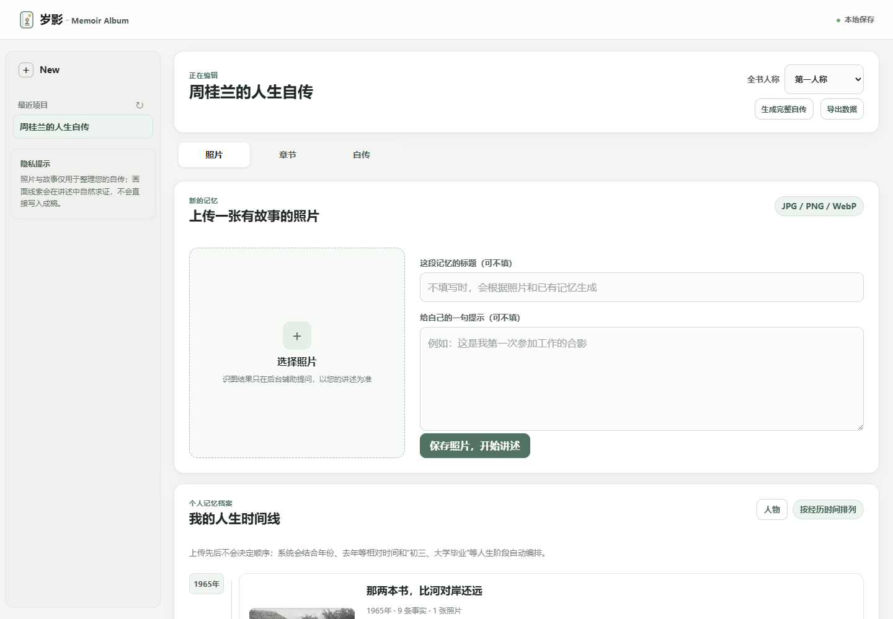
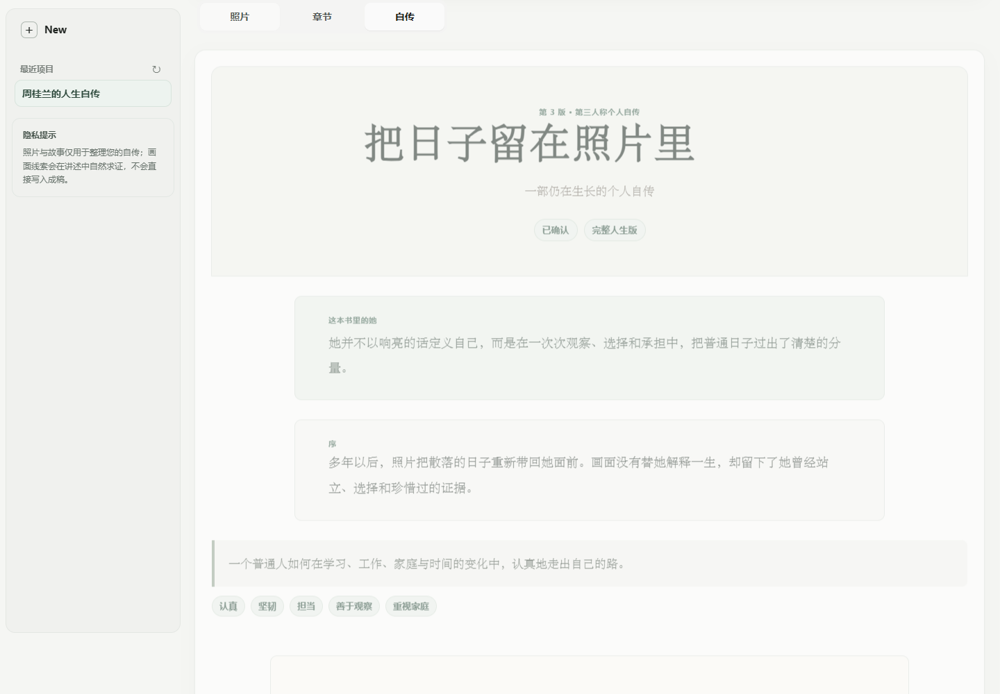
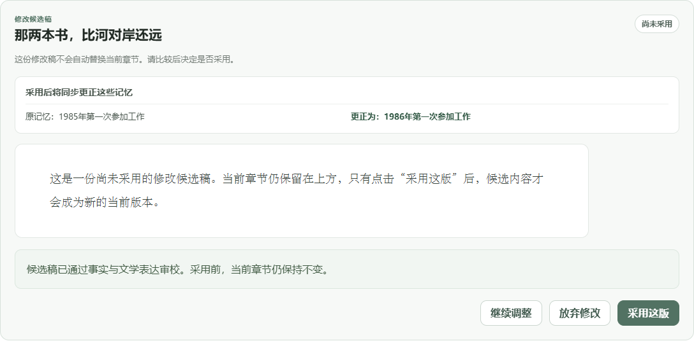

# 岁影 · Memoir Album

> 让每一张照片会讲故事，让每一个普通人都能拥有自己的自传。

岁影是一个照片驱动的多模态自传 Agent Demo。用户上传照片并通过文字讲述故事，系统在后台理解画面、进行陪伴式访谈、整理人物与人生事件，最终生成可持续生长的照片章节和第三人称个人自传。



## 为什么做这个项目

数字相册通常只保存图像与拍摄时间。多年以后，照片背后的人物关系、事件经过、当时的选择和感受很容易逐渐模糊；手动补充这些上下文又耗时、零散，并且很难进一步组织成完整作品。

岁影把照片作为记忆入口，通过自然交谈逐步补全上下文，再把分散的个人记忆整理为可以阅读、修改、分享和持续更新的人生自传。

## 核心体验

```text
上传照片 → 后台识图 → 温情访谈 → 事实与人物记忆
    → 照片章节 → 候选修改与用户仲裁 → 人生时间线
    → 整书导演 → 第三人称完整自传
```

- 照片理解：提取人物数量、场景、物件、OCR及时间地点候选；视觉猜测不会直接成为人生事实。
- 自适应访谈：结合最新回答、未解线索和共享人生记忆，每轮只追问一个真正值得继续讲的问题。
- 事件级记忆：照片上传顺序不决定人生顺序，支持跨访谈回填、人物别称统一和时间线重排。
- 文学章节：在硬事实约束下补足场景、节奏、照片意义和人生价值，而不是生成流水账。
- 候选修改：新稿不会自动覆盖当前章节；用户可继续调整、放弃或采用。
- 记忆隔离：文风修改不污染事实；明确事实更正采用 append-only 版本，旧事实可追溯。
- 完整自传：整书 Agent 统一人物、暗线、章节衔接和前后呼应，生成持续生长的第三人称作品。
- 私密分享：分享链接绑定具体已确认版本，后续改稿不会静默改变已经分享的内容。



### 修改不会偷偷覆盖原稿



## Multi-Agent 设计

Agent 只生成结构化建议，不能直接写核心数据库；所有状态迁移由确定性 Orchestrator 串行提交。

| Agent / 服务 | 职责 |
|---|---|
| Vision Agent | 提取照片可见线索，严格区分观察与事实 |
| Interview Agent | 情绪承接、线索追踪和单问题追问 |
| Memory Agent | 从用户原话提取可追溯人物、时间、地点和事件事实 |
| Title Agent | 综合照片、用户说明和共享记忆生成文学标题 |
| Chapter Agent | 基于事实包、访谈、视觉证据和写作方法卡生成章节 |
| Review Agent | 检查人称、硬事实、直接引语和无依据补写 |
| Book Director | 规划人物发展、章节衔接和跨章叙事暗线 |
| Orchestrator | 版本、事务、确认、分享与失败回退的唯一写入入口 |

## 技术栈

- Backend：Python、FastAPI、Pydantic、SQLite
- Frontend：原生 HTML、CSS、JavaScript
- Models：DeepSeek Compatible API、独立 Vision API、离线 Mock Gateway
- Retrieval：本地写作方法卡 RAG，检索快照随版本保存
- Memory：事件级 Timeline Memory、共享人生快照、阈值触发的上下文压缩
- Engineering：不可变章节版本、候选稿仲裁、模型运行审计、Docker、GitHub Actions

## 本地快速启动

要求 Python 3.11+。默认使用 Mock 模式，无需 API Key，也不会向外部服务发送文字或图片。

```powershell
git clone https://github.com/nghjjnjnf/memoir-album.git
cd life-story-agent
Copy-Item .env.example .env
./run.ps1
```

浏览器打开 [http://127.0.0.1:8000](http://127.0.0.1:8000)。

如果希望先看到一套无需 API Key 的完整合成案例，可在首次启动前执行：

```powershell
python scripts/seed_demo.py
./run.ps1
```

脚本会用三张合成照片生成访谈、章节、时间线和第三人称自传，并在终端打印可直接访问的项目链接；重复执行不会重复创建。

也可以使用通用命令：

```bash
python -m venv .venv
# Windows: .venv\Scripts\activate
# macOS/Linux: source .venv/bin/activate
pip install -r requirements.txt
python -m uvicorn app.main:app --host 127.0.0.1 --port 8000
```

## Docker 启动

```bash
docker compose up --build
```

默认仍为 Mock 模式，运行数据保存在 Docker volume 中。

## 使用 DeepSeek

复制配置模板后，在本地 `.env` 中填写自己的密钥：

```dotenv
USE_MOCK_LLM=false
DEEPSEEK_API_KEY=your_key_here
VISION_MODE=deepseek_api
DEEPSEEK_VISION_API_KEY=your_vision_key_here
```

`.env`、数据库、用户照片、浏览器测试配置、日志和模型运行结果均已加入 `.gitignore`。密钥只由后端读取，不会进入前端代码。

## 测试与合成数据

```bash
python -m pytest -q
python scripts/run_synthetic_e2e.py --provider mock
```

当前有48项自动化测试，覆盖照片安全、访谈策略、记忆抽取、时间解析、上下文压缩、章节生成、候选修改、事实追加更正、版本确认、分享绑定和整书编排。自动测试使用临时目录与 Mock 模型，不调用 DeepSeek。

`evals/fixtures/` 提供三张合成照片和配套口述，可用于无隐私风险的端到端演示。

## 重要目录

```text
app/
  main.py             FastAPI 路由
  orchestrator.py     工作流与唯一提交入口
  agents.py           Agent 输入输出编排
  prompts.py          访谈、写作与审校 Prompt
  context_memory.py   共享记忆与上下文压缩
  static/             本地 Demo 前端
knowledge/            写作方法 RAG 卡片
evals/fixtures/       合成测试照片与口述
tests/                48项自动化回归
docs/                 产品、记忆、RAG与实施文档
```

## 隐私边界

- 原始照片、录音和用户口述默认只保存在本地运行目录。
- 视觉识别结果属于待确认线索，不能直接升级为人物身份或人生事实。
- 生成文章属于叙事派生物，不能反向成为事实来源。
- 分享前必须确认具体版本；分享链接可撤回且不暴露原图下载入口。
- 本仓库不包含真实 API Key、本地数据库或用户媒体文件。

## 当前边界

这是本地 Web MVP，目前尚未接入语音识别、语音朗读、正式用户认证、云端对象存储和微信小程序。相关设计与迁移边界记录在 [`docs/`](docs/) 中。
